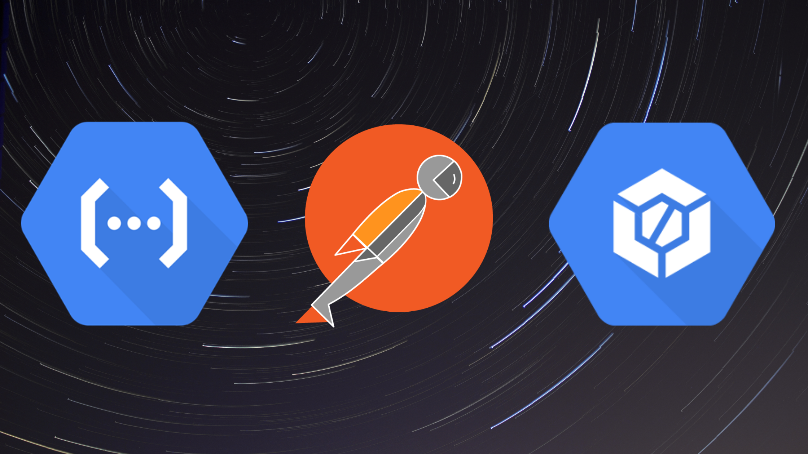
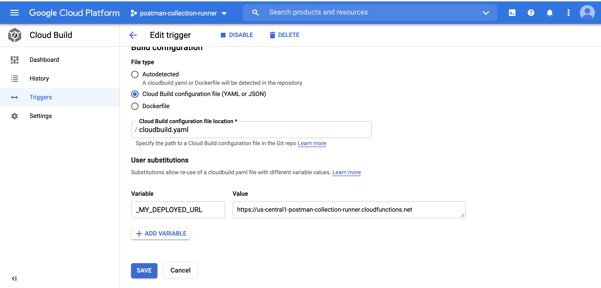
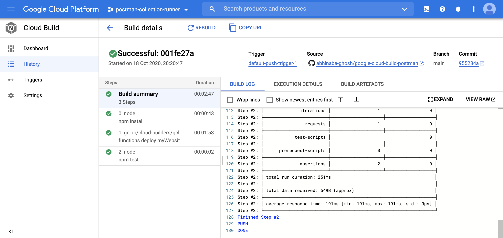

### google-cloud-build-postman

Cloud Functions is an event-driven serverless compute platform. Cloud Functions allows you to write your code without worrying about provisioning resources or scaling to handle changing requirements. This repository provide you a glimpse of

-   How to deploy your backend as [Cloud Functions in GCP](https://cloud.google.com/functions/)
-   Testing the cloud functions with [Postman](https://www.postman.com/) and [Newman](https://github.com/postmanlabs/newman)
-   Automate the deploying process with [Cloud Build](https://cloud.google.com/cloud-build)
-   Slack integration to get notification after each build

#### Steps to Deploy and Test

-   Signup to GCP, Its nearly free for a year!
-   Install the `gcloud` command line tool as per your operating system
-   Clone this repository
-   Install the dependencies

```bash
npm i
```

-   Run the backend locally to check everything works fine

```bash
npm start
```

-   if all runs well, navigate to the browser and open `http://localhost:8081/api/portfolio`. It should show the json response.

-   Run unit test with command

```
npm run test:unit
```

-   Stop the local service and deploy it to the GCP

```
gcloud beta functions deploy myWebsiteBackend --trigger-http --runtime nodejs10
```

-   Once the function got deployed you will receive the `endpoint` printed in the `console. Grab the endpoint

-   Push this as a new repository in your own Github/any-other source code management space.

-   Create a trigger with installing [github Could Build App](https://github.com/marketplace/google-cloud-build) for your repository.

-   Now go to the [Cloud Build](https://console.cloud.google.com/cloud-build) console and navigate to `Trigger` section. Create a new trigger of your choice. Just keep in mind to provide a `user substitute` value with your grabbed url in earlier function deployment stage



-   Now, trigger the run or push a commit to your repo. You can see the magic happening in the newly triggered build.



#### More

Find more in this [ Medium Article](https://medium.com/@abhinabaghosh.1994/how-postman-and-google-cloud-build-helps-you-ship-cloud-functions-faster-cbfd4c424bac)

#### Suggestions/PR

Any suggestions/PR top rectify flows is welcome!
